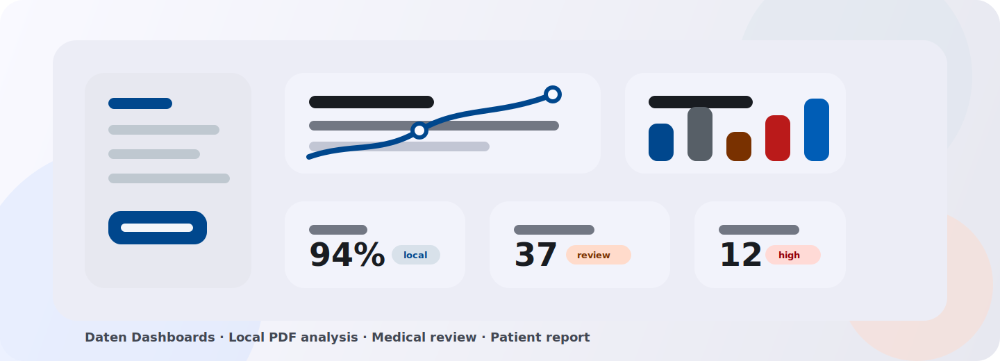
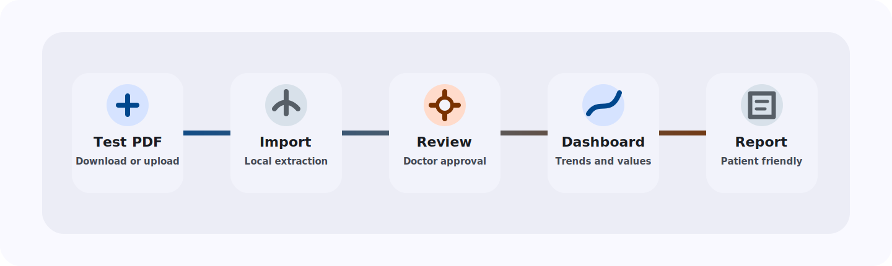

<div align="center">

# Daten Dashboards

### Local Lab Insight Hub

**A local lab-results assistant for structured PDF analysis, medical review, and clear patient reports.**

<br>



<br>


</div>

---

## Vision

**Daten Dashboards** is not just a dashboard. It is a full local workflow from lab report import to reviewed medical data and a clear patient-facing report.

The system helps doctors structure, compare and review lab values faster. Patients receive a readable and understandable overview based only on medically released data.

> The system does not provide diagnoses. Medical evaluation and release always remain the doctor's responsibility.

---

## Core Workflow



---

## Project Areas

<table>
  <tr>
    <td width="50%">
      <h3>Import Pipeline</h3>
      <p>Upload optimized test PDFs or start a demo analysis. The backend creates import jobs, extracts text locally and detects lab values, units and reference ranges.</p>
    </td>
    <td width="50%">
      <h3>Medical Review</h3>
      <p>Doctors inspect uncertain values, compare the original source snippet with extracted data and correct result, unit or reference range before release.</p>
    </td>
  </tr>
  <tr>
    <td width="50%">
      <h3>Analysis Dashboard</h3>
      <p>Released values are grouped by medical areas, visualized with status indicators, reference ranges, trend charts and comparison views.</p>
    </td>
    <td width="50%">
      <h3>Patient Report</h3>
      <p>Patients receive a responsive HTML report with plain-language explanations, relevant questions for the doctor and a print-optimized layout.</p>
    </td>
  </tr>
</table>

---

## Features

### Backend

- Django REST Framework API for uploads, import jobs, review, release, dashboard data and report previews
- PostgreSQL schema designed for at least 3NF, with BCNF where useful
- Local PDF text extraction and local OCR fallback
- Celery and Redis for background processing
- Versioned knowledge base for patient explanations, doctor notes and disclaimers
- Private media storage through the own API

### Frontend

- Angular application with consistent neomorphic UI components
- Start screen with **Download test-data PDF** and **Start demo analysis**
- Upload and import status views with confidence scores
- Review interface for uncertain values
- Data-first dashboard with prominent charts, reference ranges and trends
- Patient report with responsive and print-ready layout
- Datasets can stay visually collapsed and expand on hover or click, with a global show/hide toggle

### Additional

- Local-first architecture without external OCR, analysis or cloud services
- Strict separation between import, analysis, medical review and patient report
- Clear accessibility focus with readable contrast, focus states and touch-friendly layouts
- Test-data workflow without real patient data

---

## Tech Stack

| Area | Technology |
|---|---|
| Frontend | Angular |
| Backend | Django, Django REST Framework |
| Database | PostgreSQL |
| Background Jobs | Celery |
| Queue / Broker | Redis |
| File Processing | Local media storage through own API |
| PDF Analysis | Local PDF text analysis |
| OCR | Local OCR pipeline, for example Tesseract |
| Reports | HTML report with print CSS |

---

## Design System

The app uses a **soft neomorphic interface** with a calm off-white base, subtle depth and strong text contrast.

| Token | Hex |
|---|---|
| Background | `#F9F9FF` |
| Surface Container | `#ECEDF6` |
| Surface Highest | `#E1E2EA` |
| Text | `#191C21` |
| Text Muted | `#424752` |
| Primary | `#00478D` |
| Secondary | `#575F67` |
| Tertiary | `#793100` |
| Error | `#BA1A1A` |

---

## Local Development

```bash
git clone <repository-url>
cd daten-dashboards
```

Backend and frontend setup will be added as soon as the base project structure is created.

---

## Safety Scope

This project is intended for development with artificial and anonymized test data only.

- No real patient data
- No external cloud analysis
- No external OCR service
- No runtime AI diagnosis
- Doctor-controlled release before patient reports

---

## Repository Description

**Daten Dashboards is a local lab-results assistant for structured PDF analysis, medical review, and clear patient reports.**

