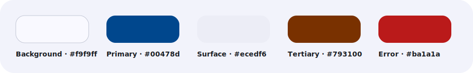
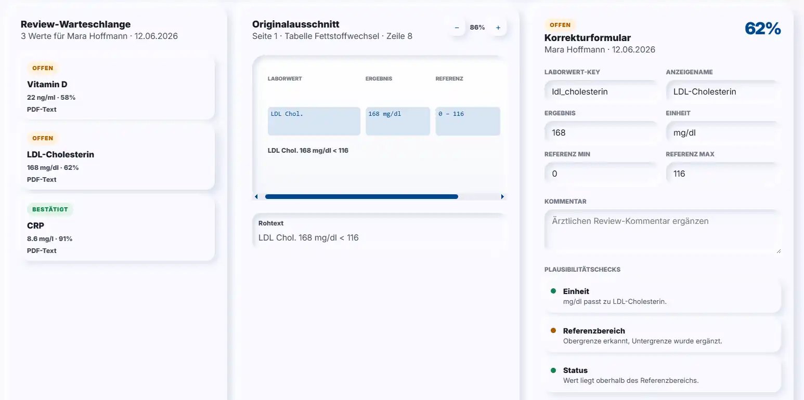
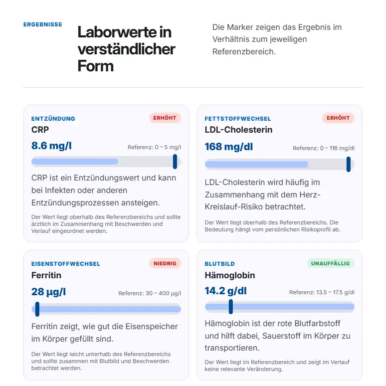

<div align="center">
  

  <h1>Globi Flow</h1>

  <p><strong>Lokales Laborwerte-Assistenzsystem für Import, ärztliche Prüfung und verständliche Patientenberichte.</strong></p>

  <p><a href="https://github.com/benjaminBennewitz/Globi-Flow.git">Repository</a></p>

  <br>

  
  
  
</div>

---

## Projektidee

Globi Flow ist ein lokales Frontend für einen vollständigen Laborwerte-Workflow. Die App trennt Import, Analyse, ärztliche Prüfung und Patientenbericht klar voneinander. Ziel ist eine nachvollziehbare Struktur für Testdaten-Laborbefunde, ohne echte Patientendaten und ohne externe Analyse- oder OCR-Services.

<table>
  <tr>
    <td width="33%"><strong>Import</strong><br>PDF hochladen, Demo starten, Confidence erfassen und Rohdaten sichtbar machen.</td>
    <td width="33%"><strong>Review</strong><br>Unsichere Werte prüfen, korrigieren und für Auswertungen freigeben.</td>
    <td width="33%"><strong>Report</strong><br>Freigegebene Werte patientenverständlich als HTML-/Print-Ansicht darstellen.</td>
  </tr>
</table>

## Designsystem

Die Oberfläche nutzt ein helles, gebrochenes Soft-UI-System mit medizinischem Blau, warmem Akzent und klaren Statusfarben. Die wichtigsten Tokens sind direkt aus dem Designsystem übernommen.



## Preview

| Übersicht | Review | Patientenbericht |
|---|---|---|
|  |  |  |

## Workflow

```text
Testdaten-PDF / Demo
        ↓
Lokaler Importjob
        ↓
PDF-Textanalyse oder lokale OCR
        ↓
Normalisierung von Wert, Einheit und Referenzbereich
        ↓
Confidence Score + Review Queue
        ↓
Ärztliche Prüfung und Freigabe
        ↓
Dashboard, Verlauf und Patientenbericht
```

## Aktuelle Frontend-Routen

| Route | Zweck |
|---|---|
| `/uebersicht` | Praxisübersicht mit Kennzahlen, Verlauf und Aufgaben |
| `/patienten` | Testpersonen, aktiver Patient und Befundkontext |
| `/importe` | Upload, Demo-Import, Importstatus und Fortschritt |
| `/review` | Prüfschleuse für unsichere Laborwerte |
| `/auswertung` | Analyseansicht mit Gruppen, Trends und Auffälligkeiten |
| `/wissensbasis` | Pflege kontrollierter Erklärtexte und Quellen |
| `/berichte` | Patientengerechte HTML-/Print-Vorschau |

## Start

```powershell
npm install
npm start
```

Die lokale Entwicklung läuft standardmäßig auf Port `4300`.

```powershell
npm run build:prod
```

Der Production-Build wird nach `dist/globi-flow` geschrieben.

## Projektstruktur

```text
src/app/core        Modelle, Mockdaten, API-Endpunkte, Security-Utilities
src/app/features    Wiederverwendbare Feature-Komponenten
src/app/pages       Routen-Komponenten
src/app/shared      Navigation, Suche, Toasts und UI-Bausteine
src/styles          Globale Tokens, Basis, Utilities und Animationen
src/assets          Logo, Favicon, Fonts und Testdaten-PDF
```

## Fachliche Leitplanken

- Es werden ausschließlich künstliche Testdaten genutzt.
- Die App stellt keine Diagnosen.
- Medizinische Bewertung und Freigabe bleiben beim Arzt.
- Wissensinhalte stammen aus kontrollierten Einträgen, nicht aus Laufzeit-KI-Ausgaben.
- PDF-Analyse und OCR sind für lokale Verarbeitung vorgesehen.

## Rebranding-Stand

- Angular-Projektname: `globi-flow`
- Angular-Selector-Prefix: `gf`
- CSS-/SCSS-Token-Prefix: `gf`
- Repository: `https://github.com/benjaminBennewitz/Globi-Flow.git`

## Version

Angular `21.2.x`